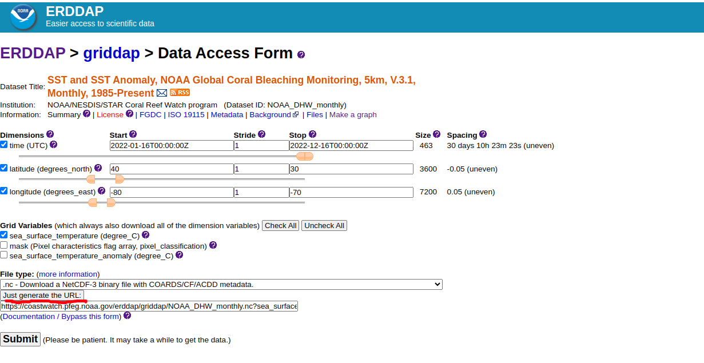
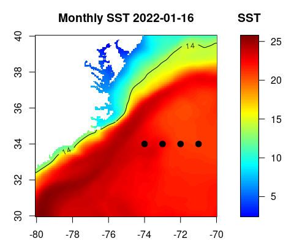
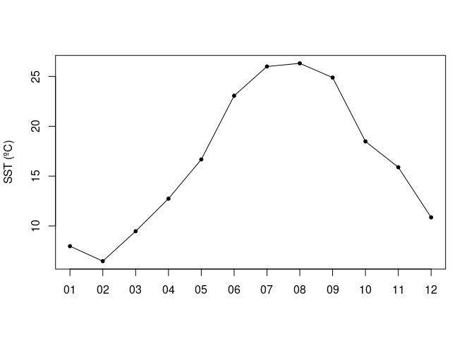
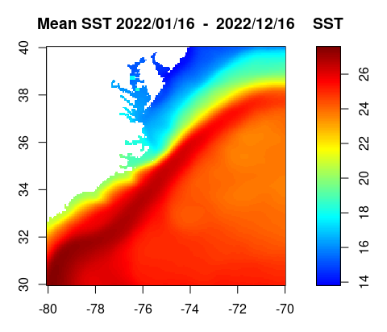

A tidyverse/ggplot version is also available here:
<https://github.com/jebyrnes/noaa_coastwatch_tutorial_1/blob/main/tutorial1-1.md>

courtesy of Jarrett Byrnes from UMass Boston - <http://byrneslab.net>
(Thank you Jarrett!!)

## Objective

This tutorial will show the steps to grab data hosted on an ERDDAP
server from Python, how to work with NetCDF files in Python and how to
make some maps and time-series of sea surface temperature.

## The tutorial demonstrates the following techniques

-   Locating a satellite product in ERDDAP, manually changing the
    constraints and copying the URL defining the data request
-   Downloading the resulting NetCDF file
-   Opening and examining the NetCDF file
-   Making basic maps and time series plots

## Datasets used

**CoralTemp Sea Surface Temperature** product from the NOAA Coral Reef
Watch program. The NOAA Coral Reef Watch (CRW) daily global 5km Sea
Surface Temperature (SST) product, also known as CoralTemp, shows the
nighttime ocean temperature measured at the surface. The SST scale
ranges from -2 to 35 °C. The CoralTemp SST data product was developed
from two, related reanalysis (reprocessed) SST products and a near
real-time SST product. Spanning January 1, 1985 to the present, the
CoralTemp SST is one of the best and most internally consistent daily
global 5km SST products available. More information about the product:
<https://coralreefwatch.noaa.gov/product/5km/index_5km_sst.php>

We will use the monthly composite of this product and download it from
the NOAA CoastWatch ERDDAP server:
<https://coastwatch.pfeg.noaa.gov/erddap/griddap/NOAA_DHW_monthly.graph>

    # Package names
    packages <- c( "ncdf4","httr")

    # Install packages not yet installed
    installed_packages <- packages %in% rownames(installed.packages())

    if (any(installed_packages == FALSE)) {
      install.packages(packages[!installed_packages])
    }

    # Load packages 
    invisible(lapply(packages, library, character.only = TRUE))

## 1. Downloading data from R

Because ERDDAP includes RESTful services, you can download data listed
on any ERDDAP platform from R using the URL structure.

For example, the following page allows you to subset monthly sea surface
temperature (SST)
<https://coastwatch.pfeg.noaa.gov/erddap/griddap/NOAA_DHW_monthly.html>

Select your region and date range of interest, then select the ‘.nc’
(NetCDF) file type and click on “Just Generate the URL”.

 NOTE: Notice that the
latitudes are indexed from North to South (negative spacing)

In this specific example, the URL we generated is :
<https://coastwatch.pfeg.noaa.gov/erddap/griddap/NOAA_DHW_monthly.nc?sea_surface_temperature%5B(2022-01-16T00:00:00Z>):1:(2022-12-16T00:00:00Z)%5D%5B(40):1:(30)%5D%5B(-80):1:(-70)%5D

You can also edit this URL manually.

In R, run the following to download the data using the generated URL
(you need to copy it from your browser):

    junk <- GET('https://coastwatch.pfeg.noaa.gov/erddap/griddap/NOAA_DHW_monthly.nc?sea_surface_temperature%5B(2022-01-16T00:00:00Z):1:(2022-12-16T00:00:00Z)%5D%5B(40):1:(30)%5D%5B(-80):1:(-70)%5D', write_disk("sst.nc", overwrite=TRUE))

## 2. Importing the downloaded file in R

Now that we’ve downloaded the data locally, we can import it and extract
our variables of interest:

-   open the file

<!-- -->

    nc <- nc_open('sst.nc')

-   examine which variables are included in the dataset:

<!-- -->

    names(nc$var)

    ## [1] "sea_surface_temperature"

-   Extract sea\_surface\_temperature:

<!-- -->

    v1 <- nc$var[[1]]
    sst <- ncvar_get(nc,v1)

-   examine the structure of sst:

<!-- -->

    dim(sst)

    ## [1] 201 202  12

Our dataset is a 3-D array with 201 rows corresponding to longitudes,
202 columns corresponding to latitudes for each of the 12 time steps.

-   get the dates for each time step:

<!-- -->

    dates <- as.POSIXlt(v1$dim[[3]]$vals,origin='1970-01-01',tz='GMT')
    dates

    ##  [1] "2022-01-16 GMT" "2022-02-16 GMT" "2022-03-16 GMT" "2022-04-16 GMT"
    ##  [5] "2022-05-16 GMT" "2022-06-16 GMT" "2022-07-16 GMT" "2022-08-16 GMT"
    ##  [9] "2022-09-16 GMT" "2022-10-16 GMT" "2022-11-16 GMT" "2022-12-16 GMT"

-   get the longitude and latitude values

<!-- -->

    lon <- v1$dim[[1]]$vals
    lat <- v1$dim[[2]]$vals

-   Close the netcdf file and remove the data and files that are not
    needed anymore.

<!-- -->

    nc_close(nc)
    rm(junk,v1)
    file.remove('sst.nc')

    ## [1] TRUE

## 3. Working with the extracted data

### Creating a map for one time step

Let’s create a map of SST for January 2022 (our first time step).

You will need to download the
[scale.R](https://oceanwatch.pifsc.noaa.gov/files/scale.R) file and copy
it to your working directory to plot the color scale properly.

-   set some color breaks

<!-- -->

    h <- hist(sst[,,1], 100, plot=FALSE)
    breaks <- h$breaks
    n <- length(breaks)-1

-   define a color palette

<!-- -->

    jet.colors <- colorRampPalette(c("blue", "#007FFF", "cyan","#7FFF7F", "yellow", "#FF7F00", "red", "#7F0000"))

-   set color scale using the jet.colors palette

<!-- -->

    c <- jet.colors(n)

-   prepare graphic window : left side for map, right side for color
    scale

<!-- -->

    layout(matrix(c(1,2), nrow=1, ncol=2), widths=c(7,2), heights=4)
    par(mar=c(3,3,3,1))

    #plot the SST map. Because this product was built with latitudes going from North to South, we need to reverse the lat vector because the 'image' function needs increasing values for the coordinates. We also need to flip the sst matrix along the 2d dimension so it plots correctly
    image(lon,rev(lat),sst[,dim(sst)[2]:1,1],col=c,breaks=breaks,xlab='',ylab='',axes=TRUE,xaxs='i',yaxs='i',asp=1, main=paste("Monthly SST", dates[1]))

    #example of how to add points to the map
    points(-74:-71,rep(34,4), pch=20, cex=2)

    #example of how to add a contour (this is considered a new plot, not a feature, so you need to use par(new=TRUE)) to overlay it on top of the SST map
    par(new=TRUE)
    contour(lon,rev(lat),sst[,dim(sst)[2]:1,1],levels=14,xaxs='i',yaxs='i',labcex=0.8,vfont = c("sans serif", "bold"),axes=FALSE,asp=1)

    #plot color scale using 'image.scale' function from 'scale.R' script)
    par(mar=c(3,1,3,3))
    source('scale.R')
    image.scale(sst[,,1], col=c, breaks=breaks, horiz=FALSE, yaxt="n",xlab='',ylab='',main='SST')
    axis(4, las=1)
    box()

### Plotting a time series

Let’s pick the following box : 36-38N, -77 to -75W.. We are going to
generate a time series of mean SST within that box.

    I=which(lon>=-77 & lon<=-75)
    J=which(lat>=36 & lat<=38)
    sst2=sst[I,J,]
    n=dim(sst2)[3]
    res=rep(NA,n)
    for (i in 1:n)
    res[i]=mean(sst2[,,i],na.rm=TRUE)
    plot(1:n,res,axes=FALSE,type='o',pch=20,xlab='',ylab='SST (ºC)')
    axis(2)
    axis(1,1:n,format(dates,'%m'))
    box()

### Creating a map of average SST over a year

    sst.yr=apply(sst[,,1:12],c(1,2),mean,na.rm=TRUE)
    h=hist(sst.yr, 100, plot=FALSE)
    breaks=h$breaks
    n=length(breaks)-1
    c=jet.colors(n)
    layout(matrix(c(1,2), nrow=1, ncol=2), widths=c(7,2), heights=4)
    par(mar=c(3,3,3,1))
    image(lon,rev(lat),sst.yr[,dim(sst.yr)[2]:1],col=c,breaks=breaks,xlab='',ylab='',axes=TRUE,xaxs='i',yaxs='i',asp=1,main=paste("Mean SST", format(dates[1],'%Y/%m/%d'),' - ',format(dates[12],'%Y/%m/%d')))
    par(mar=c(3,1,3,3))
    image.scale(sst.yr, col=c, breaks=breaks, horiz=FALSE, yaxt="n",xlab='',ylab='',main='SST')
    axis(4)
    box()

