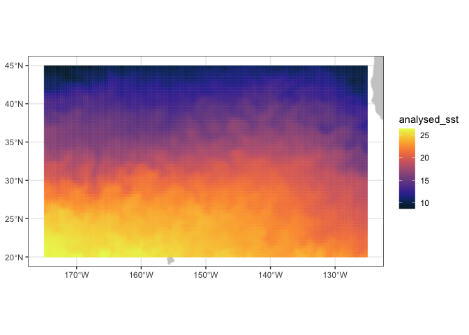
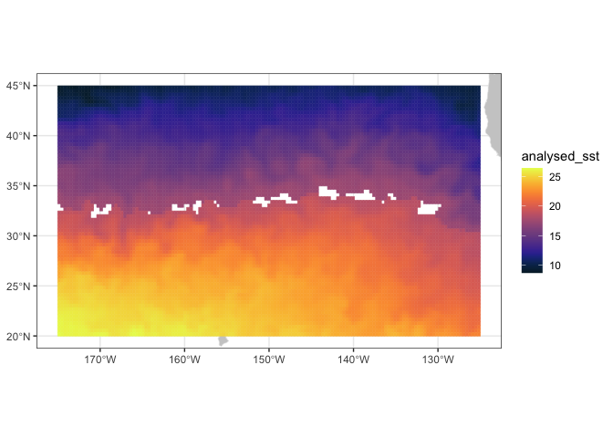
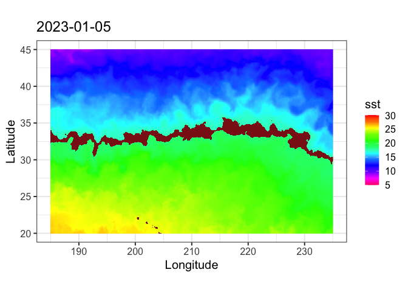

# Define a marine habitat

> notebook filename \| define_marine_habitat.Rmd

# Context

The [TurleWatch
project](https://oceanwatch.pifsc.noaa.gov/turtlewatch.html)
investigated the overlap between loggerhead sea turtles habitat and
fishing effort of the Hawaii-based shallow-set longline fishery in the
Pacific Ocean north of the Hawaiian Islands. That fishery, which targets
swordfish, used to experience high levels of bycatch of loggerhead
turtles. Considerable changes in gear and operations lowered bycatch
rate and the TurtleWatch product was designed as a tool to advise
fishermen on areas to avoid to limit bycatch.

Research results indicated that 50% of interactions occurred between
17.5°C and 18.5°C.

# Objective

Here we will draw the 17.5 and 18.5ºC temperature contours on a map of
satellite sea surface temperature.

# The tutorial demonstrates the following techniques

- Using the *xtracto_3D* function to extract data from a rectangular
  area  
- Masking a data array  
- Plotting maps using plotBBox and ggplot

# Datasets used

CoralTemp Sea Surface Temperature product from the NOAA Coral Reef Watch
program. The NOAA Coral Reef Watch (CRW) daily global 5km Sea Surface
Temperature (SST) product, also known as CoralTemp, shows the nighttime
ocean temperature measured at the surface. The SST scale ranges from -2
to 35 °C. The CoralTemp SST data product was developed from two, related
reanalysis (reprocessed) SST products and a near real-time SST product.
Spanning January 1, 1985 to the present, the CoralTemp SST is one of the
best and most internally consistent daily global 5km SST products
available. More information about the product:
<https://coralreefwatch.noaa.gov/product/5km/index_5km_sst.php>

## Install required packages and load libraries

``` r
# Function to check if pkgs are installed, install missing pkgs, and load
pkgTest <- function(x)
{
  if (!require(x,character.only = TRUE))
  {
    install.packages(x,dep=TRUE,repos='http://cran.us.r-project.org')
    if(!require(x,character.only = TRUE)) stop(x, " :Package not found")
  }
}

list.of.packages <- c( "ncdf4", "rerddap", "plotdap", "RCurl",  
                       "raster", "colorRamps", "maps", "mapdata",
                       "ggplot2", "RColorBrewer", "rerddapXtracto")

# create list of installed packages
pkges = installed.packages()[,"Package"]

for (pk in list.of.packages) {
  pkgTest(pk)
}
```

## Select the Satellite Data

- Use the CoralTemp SST dataset (ID CRW_sst_v3_1) from the OceanWatch
  ERDDAP server
  (<https://oceanwatch.pifsc.noaa.gov/erddap/index.html>)  
- Gather information about the dataset (metadata) using **rerddap**  
- Display the information

``` r
# Let's look at the metadata


url = "https://oceanwatch.pifsc.noaa.gov/erddap/"
dataInfo <- rerddap::info('CRW_sst_v3_1',url=url)
parameter <- 'analysed_sst'
```

``` r
dataInfo
```

    ## <ERDDAP info> CRW_sst_v3_1 
    ##  Base URL: https://oceanwatch.pifsc.noaa.gov/erddap 
    ##  Dataset Type: griddap 
    ##  Dimensions (range):  
    ##      time: (1985-01-01T12:00:00Z, 2023-09-09T12:00:00Z) 
    ##      latitude: (-89.975, 89.975) 
    ##      longitude: (0.025, 359.975) 
    ##  Variables:  
    ##      analysed_sst: 
    ##          Units: degree_C 
    ##      sea_ice_fraction: 
    ##          Units: 1

## Get Satellite Data

- Select an area of the central North Pacific where the fishery
  operates: longitude range of 185 to 235 east and latitude range of 20
  to 45 north  
- Select a date in the first quarter of the year when bycatch typically
  occurs: `tcoord=c('2023-01-06', '2023-01-06'))`. `tcoord` needs to be
  a vector even if we are pulling only one day of data.

``` r
# latitude and longitude of the vertices
ylim<-c(20,45)
xlim<-c(185,235)

# Extract the data
SST <- rxtracto_3D(dataInfo,xcoord=xlim,ycoord=ylim,parameter=parameter, 
                   tcoord=c('2023-01-06','2023-01-06'))

# Drop command needed to reduce SST from a 3D variable to a 2D  one  
SST$analysed_sst <- drop(SST$analysed_sst) 
```

## Make a quick plot using plotBBox

``` r
plotBBox(SST, plotColor = 'thermal')
```

<!-- -->

``` r
         #,maxpixels=1000000)
```

## Define and plot the TurtleWatch temperature band

\_\_ Set the temperature band to 17.5-18.5 degrees C, as determined by
the TurtleWatch program.\_\_

``` r
## Define turtle temperature range
min.temp <- 17.5
max.temp <- 18.5
```

**Create another variable for habitat temperature**

Set the habitat temperature to equal NA

``` r
SST2 <- SST
SST2$analysed_sst[SST2$analysed_sst >= min.temp & SST2$analysed_sst <= max.temp] <- NA
plotBBox(SST2, plotColor = 'thermal')
```

<!-- -->

It would be nicer to color in the TurtleWatch band (the NA values) with
a different color. If you want to customize graphs, it’s better to use
`ggplot` than the `plotBBox` that comes with the `rerrdapXtracto`
package. Here we will use `ggplot` to plot the data. But first the data
is reformatted for use in `ggplot`.

Restructure the data

``` r
dims <- dim(SST2$analysed_sst)
SST2.lf <- expand.grid(x=SST$longitude,y=SST$latitude)
SST2.lf$sst<-array(SST2$analysed_sst,dims[1]*dims[2])
```

## Plot the Data using ‘ggplot’

``` r
coast <- map_data("worldHires", ylim = ylim, xlim = xlim)

par(mar=c(3,3,.5,.5), las=1, font.axis=10)

myplot<-ggplot(data = SST2.lf, aes(x = x, y = y, fill = sst)) +
  geom_tile(na.rm=T) +
  geom_polygon(data = coast, aes(x=long, y = lat, group = group), fill = "grey80") +
  theme_bw(base_size = 15) + ylab("Latitude") + xlab("Longitude") +
  coord_fixed(1.3,xlim = xlim, ylim = ylim) +
  ggtitle(unique(as.Date(SST2$time))) +
  scale_fill_gradientn(colours = rev(rainbow(12)),limits=c(5,30),na.value = "firebrick4") 

myplot
```

<!-- -->
