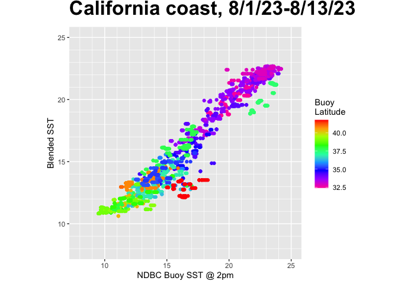
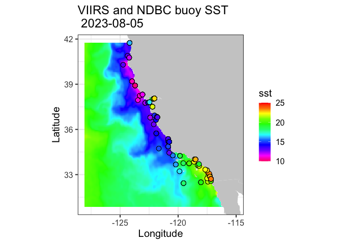

# Matchup satellite and buoy data

> history \| Updated August 2023

There are buoys in many locations around the world that provide data
streams of oceanic and atmospheric parameters. The data are often
available through data centers like the those National Data Buoy Center
(NDBC <https://www.ndbc.noaa.gov>) and ARGO floats program
(<http://www.argo.ucsd.edu>). In situ buoy data are widely used to
monitor environmental conditions.

In the absence of in situ buoy data, whether the buoy operation is
discontinued, interrupted, or limited, satellite data with close
temporal and spatial coverage can be used to create a dataset in the
format of in situ buoy data.

**In this exercise, we will learn** how to match up satellite data to in
situ buoy data using rerddap and rxtracto R packages.

The exercise demonstrates the following techniques:

- Downloading tabular data (buoy data) from CoastWatch ERDDAP data
  server
- Retrieving information about a dataset from ERDDAP
- Subsetting satellite data within a rectangular boundaries
- Matching satellite data with the buoy data
- Generating linear regression
- Producing satellite maps and overlaying buoy data

**Datasets used:**

- <a href="https://coastwatch.pfeg.noaa.gov/erddap/griddap/nesdisBLENDEDsstDNDaily.graph">The
  sea surface temperature (SST) satellite data</a> from NOAA Geo-polar
  blended analysis are used for transforming to buoy data format
- <a href="https://coastwatch.pfeg.noaa.gov/erddap/tabledap/cwwcNDBCMet.graph?time%2Cwtmp%2Cwd&station=%2246259%22&time%3E=2020-09-15T00%3A00%3A00Z&time%3C=2022-09-15T00%3A00%3A00Z&.draw=markers&.marker=5%7C5&.color=0x000000&.colorBar=%7C%7C%7C%7C%7C&.bgColor=0xffccccff">
  NDBC Standard Meteorological Buoy Data (dataset ID: cwwcNDBCMet) </a>
  was used for validating or ground truthing

**References:** -
<a href="https://coastwatch.pfeg.noaa.gov/data.html">NOAA CoastWatch
Westcoast Node Data Catalog</a> -
<a href="https://www.ndbc.noaa.gov/download_data.php?filename=46259h2017.txt.gz&dir=data/historical/stdme ">NOAA
National Data Buoy Center</a> -
<a href="https://docs.ropensci.org/rerddap/">Rerddap R Package
reference</a>

## Install required packages and load libraries

``` r
# Function to check if pkgs are installed, install missing pkgs, and load

pkgTest <- function(x)
{
  if (!require(x,character.only = TRUE))
  {
    install.packages(x,dep=TRUE)
    if(!require(x,character.only = TRUE)) stop("Package not found")
  }
}

list.of.packages <- c( "ncdf4", "rerddap", "plotdap", "httr",
                       "lubridate", "gridGraphics",  "mapdata",
                       "ggplot2", "RColorBrewer", "grid", "PBSmapping", 
                       "rerddapXtracto")

# create list of installed packages
pkges = installed.packages()[,"Package"]

for (pk in list.of.packages) {
  pkgTest(pk)
}
```

## Downloading buoy data from ERDDAP

**Extract data using the rerddap::tabledap function**  
\* \* In the region bounded by 30.86 to 41.75 north latitude and -128 to
-116 east longitude  
\* request the station, latitude, longitude, time, and water temperature
parameters  
\* put the data into a data frame

``` r
# Subset and download tabular data from ERDDAP 
buoy <- rerddap::tabledap(
  'cwwcNDBCMet', 
  fields=c('station', 'latitude',  'longitude', 'time', 'wtmp'), 
  'time>=2023-08-01',   'time<=2023-08-13', 
  'latitude>=30.86','latitude<=41.75', 'longitude>=-128','longitude<=-116',
  'wtmp>0'
)

#Create data frame with downloaded data
buoy.df <-data.frame(station=buoy$station,
                 longitude=as.numeric(buoy$longitude),
                 latitude=as.numeric(buoy$latitude),
                 time=strptime(buoy$time, "%Y-%m-%dT%H:%M:%S"),
                 sst=as.numeric(buoy$wtmp))

# Check for unique stations
unique.sta <- unique(buoy$sta)
n.sta <- length(unique.sta)
n.sta
```

    ## [1] 57

**Select buoy data closest in time to satellite data**

Since buoy data are hourly and satellite data are daily, buoy data needs
to be subsetted to the time coverage that corresponds to the time the
satellite passes overhead (22h00 GMT (2pm local + 8).

``` r
dailybuoy <- subset(buoy.df,hour(time)==22)
```

## Download Satellite SST (sea surface temperature) data

We will use Sea surface temperature (SST) satellite data from CoastWatch
West code node ERDDAP server.

URL: <https://coastwatch.pfeg.noaa.gov/erddap/> Dataset
ID:nesdisBLENDEDsstDNDaily

``` r
url=  'https://coastwatch.pfeg.noaa.gov/erddap/'
datasetid = 'nesdisBLENDEDsstDNDaily'

# Get Data Information given dataset ID and URL
dataInfo <- rerddap::info(datasetid, url)

# Show data Info
dataInfo
```

    ## <ERDDAP info> nesdisBLENDEDsstDNDaily 
    ##  Base URL: https://coastwatch.pfeg.noaa.gov/erddap 
    ##  Dataset Type: griddap 
    ##  Dimensions (range):  
    ##      time: (2019-07-22T12:00:00Z, 2023-08-13T12:00:00Z) 
    ##      latitude: (-89.975, 89.975) 
    ##      longitude: (-179.975, 179.975) 
    ##  Variables:  
    ##      analysed_sst: 
    ##          Units: degree_C 
    ##      analysis_error: 
    ##          Units: degree_C 
    ##      mask: 
    ##      sea_ice_fraction: 
    ##          Units: 1

**Extract the matchup data using rxtracto**

We will subset satellite data using buoy data information.  
1. get coordinates from buoy data 2. using rxtracto function and the
coordinates from buoy data, subset satellite data

``` r
# Set variable name of interest from satellite data
parameter <- 'analysed_sst'

# Set x,y,t,z coordinates based on buoy data
xcoord <- dailybuoy$longitude
ycoord <- dailybuoy$latitude
tcoord <- dailybuoy$time


# Extract (subset) satellite data 
extract <- rxtracto(dataInfo, parameter=parameter, 
                    tcoord=tcoord,
                    xcoord=xcoord,ycoord=ycoord,
                    xlen=.01,ylen=.01)
                     
dailybuoy$sat<-extract$`mean analysed_sst`
```

**Get subset of data where a satellite value was found**

- Not all matchup will yield data, for example due to cloud cover.

``` r
# Get subset of data where there is a satellite value 
goodbuoy<-subset(dailybuoy, sat > 0)
unique.sta<-unique(goodbuoy$sta)
nbuoy<-length(unique.sta)
ndata<-length(goodbuoy$sta)
```

## Compare results for satellite and buoy

- Plot the VIIRS satellite verses the buoy data to visualize how well
  the two datasets track each other.

``` r
# Set up map title 
main="California coast, 8/1/23-8/13/23"   

p <- ggplot(goodbuoy, aes(sst, sat,color=latitude)) + 
     coord_fixed(xlim=c(8,25),ylim=c(8,25)) 
p + geom_point() + 
  ylab('Blended SST')  + 
  xlab('NDBC Buoy SST @ 2pm') +
  scale_x_continuous(minor_breaks = seq(8, 25)) + 
  scale_y_continuous(minor_breaks = seq(8, 25)) + 
  #geom_abline(a=fit[1],b=fit[2]) +
  #annotation_custom(my_grob) + 
  scale_color_gradientn(colours = rev(rainbow(9)), name="Buoy\nLatitude") +
  labs(title=main) + theme(plot.title = element_text(size=25, face="bold", vjust=2)) 
```

<!-- -->

Run a linear regression of Blended satellite verses the buoy data. \*
The R squared in close to 1 (0.9807) \* The slope is near 1 (0.950711)

``` r
lmHeight = lm(sat~sst, data = goodbuoy)
summary(lmHeight)
```

    ## 
    ## Call:
    ## lm(formula = sat ~ sst, data = goodbuoy)
    ## 
    ## Residuals:
    ##     Min      1Q  Median      3Q     Max 
    ## -4.0823 -0.5010  0.2333  0.7072  3.4517 
    ## 
    ## Coefficients:
    ##             Estimate Std. Error t value Pr(>|t|)    
    ## (Intercept) 1.180988   0.092772   12.73   <2e-16 ***
    ## sst         0.897339   0.005369  167.14   <2e-16 ***
    ## ---
    ## Signif. codes:  0 '***' 0.001 '**' 0.01 '*' 0.05 '.' 0.1 ' ' 1
    ## 
    ## Residual standard error: 1.101 on 2532 degrees of freedom
    ## Multiple R-squared:  0.9169, Adjusted R-squared:  0.9169 
    ## F-statistic: 2.794e+04 on 1 and 2532 DF,  p-value: < 2.2e-16

## Create a satellite map and overlay buoy data

**Extract VIIRS chlorophyll data for the month of August 2018**

``` r
# First define the box and time limits of the requested data 
ylim<-c(30.87,41.75)
xlim<-c(-128,-115)

# Extract the monthly satellite data
SST <- rxtracto_3D(dataInfo,xcoord=xlim,ycoord=ylim,parameter=parameter, 
                   tcoord=c('2023-08-06','2023-08-06'))

SST$sst <- drop(SST$analysed_sst)
```

**Create the map frame for the satellite data and buoy SST overlay**

``` r
mapFrame<- function(longitude,latitude,sst){
  dims<-dim(sst)
  sst<-array(sst,dims[1]*dims[2])
  sstFrame<-expand.grid(x=longitude,y=latitude)
  sstFrame$sst<-sst
  return(sstFrame)
}

sstFrame<-mapFrame(SST$longitude,SST$latitude,SST$sst)
coast <- map_data("worldHires", ylim = ylim, xlim = xlim)
my.col <- colorRampPalette(rev(brewer.pal(11, "RdYlBu")))(22-13) 

buoy2<-subset(dailybuoy, month(time)==8 &day(time)==5 & sst > 0)
```

**Create the map**

``` r
myplot<-ggplot(data = sstFrame, aes(x = x, y = y, fill = sst)) +
  geom_tile(na.rm=T) +
  geom_polygon(data = coast, aes(x=long, y = lat, group = group), fill = "grey80") +
  theme_bw(base_size = 15) + ylab("Latitude") + xlab("Longitude") +
  coord_fixed(1.3,xlim = xlim, ylim = ylim) +
  scale_fill_gradientn(colours = rev(rainbow(12)),limits=c(10,25),na.value = NA) +
  ggtitle(paste("VIIRS and NDBC buoy SST \n", unique(as.Date(SST$time)))) +
  geom_point(data=buoy2, aes(x=longitude,y=latitude,color=sst),size=3,shape=21,color="black") + 
  scale_color_gradientn(colours = rev(rainbow(12)),limits=c(10,25),na.value ="grey20") 
  
myplot
```

<!-- -->
