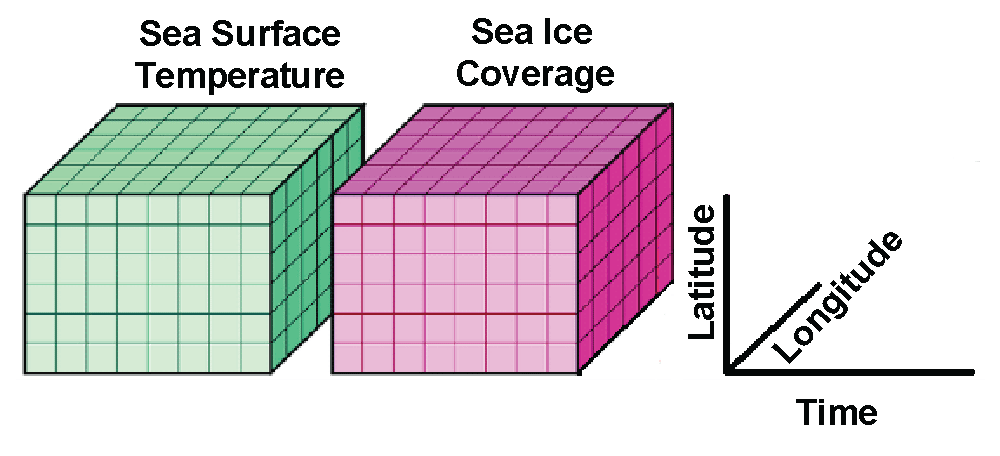
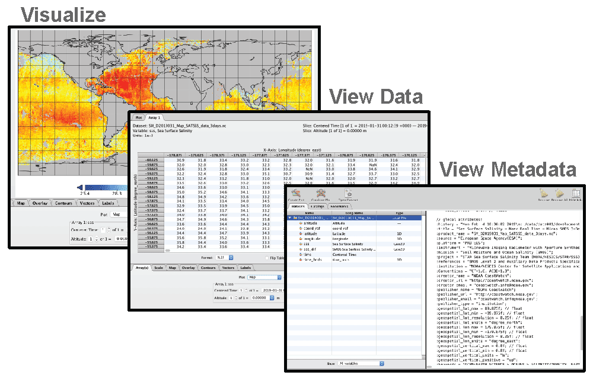
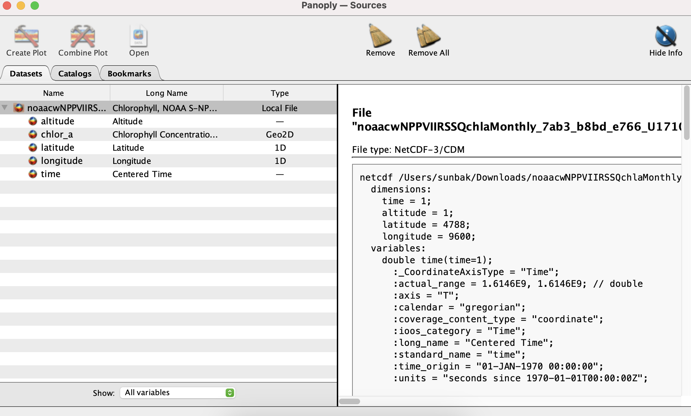
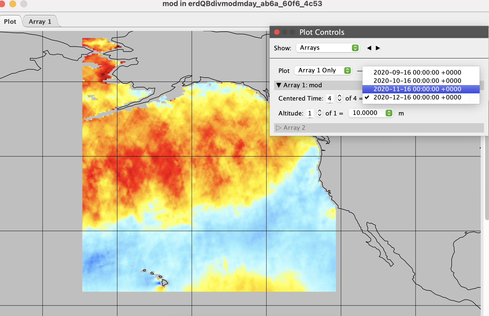

# NetCDF and Panoply tutorial  
> Updated March 2024

## NetCDF 

**NetCDF (Network Common Data Form)** is a file format for storing multidimensional scientific data (variables), including satellite observations of variable we wll use in the course such as sea surface temperature, salinity, chlorophyll concentration, and wind speed. Many organizations and scientific groups in different countries have adopted netCDF as a standard way to represent some forms of scientific data.

The NetCDF format has many advantages, the most important of which is that it is **self-describing**, meaning that software packages can directly read the data and determine its structure, the variable names and essential metadata such as the units. This self-describing aspect of the netCDF file format means that the information needed to ensure accurate work (reduce the incidence of errors) is available within the data itself (no need for additional files). Secondly, it means that different analysis software, like Matlab, R, Python or ArcGIS (among many others), have utilities to read and work with NetCDF files. Thirdly, plotting software (e.g. Ferret, **Panoply**, ncview) can directly read the netCDF files for visualization.

## NASA Panoply 

NASA developed the Panoply viewer that allows users to view and visualize data held in NetCDF files. Some feature is the software include:

* Visualize data from netCDF and HDF files
* View the metadata
* View the data
* Display the data in many different map projections
* Download visualization as images
* Create animations
* Freeware

Panoply is available for download at: [https://www.giss.nasa.gov/tools/panoply/](https://www.giss.nasa.gov/tools/panoply/) and can be run on Windows, Mac and Linux computers. 

A set of "how to" instructions can be found to the following URL   
[https://www.giss.nasa.gov/tools/panoply/help/](https://www.giss.nasa.gov/tools/panoply/help/)  
Below are a few examples to try out to get you used to visualizing data with the Panoply Viewer.
:::{.callout-warning title="Panoply Version"}
The examples shown are based on Panoply Verion 5.3.3, and the interface may differ baed on the version downloaded.
:::

## Example #1. Make a map of global chlorophyll a concentration 

* Download the a global netCDF file of the NOAA VIIRS, Science Quality Chlorophyll dataset from the West Coast Node ERDDAP by clicking on the link below. The link will open in your default browser and begin the download for the monthly average for March 2021. [https://coastwatch.pfeg.noaa.gov/erddap/griddap/nesdisVHNSQchlaMonthly.nc?chlor_a[(2021-03-01T12:00:00Z)][(0.0)][(89.75625):(-89.75626)][(-179.9812):(179.9813)]&.draw=surface&.vars=longitude|latitude|chlor_a](https://coastwatch.pfeg.noaa.gov/erddap/griddap/nesdisVHNSQchlaMonthly.nc?chlor_a[%282021-03-01T12:00:00Z%29][%280.0%29][%2889.75625%29:%28-89.75626%29][%28-179.9812%29:%28179.9813%29]&.draw=surface&.vars=longitude|latitude|chlor_a)
* Launch Panoply.
* When Panoply opens, it prompts you to open a file. Open the file you just downloaded.
  * __On the left side__, Panoply displays a list of the variables contained within the file, including time, altitude, longitude, latitude, and chlorophyll-a (chlor_a).
  * __On the right side__, the file's metadata is presented when you select a variable name from the list on the left. Scroll down to explore additional details about the selected variable. 

* You can visualize the chlor_a variable data.
  * On the leftside of the screen, double-click on the chlor_a variable.  Keep the default settings and click Create.(this will take a minute, it’s a big file)
  * Panoply generates an image of the chlorophyll data contained in the file, and opens a popup window "Plot Controls".

* View the Data
  * Above the image, click on the “Array 1” tab. This shows you all the values of chlorophyll concentration contained in the file for each longitude/latitude pixel.

* Adjust the Plot Scale:
  * Navigate back to the "Plot" tab.
  * Within the Plot Controls popup window, proceed to the "Show" section and select "Scale"
  * Modify the "Units" setting, changing it from "scalar" to "log10."
  * Update the "Range" settings to a minimum of 0.02 and a maximum of 2.0.
  * Under the "Color Table" section, you can explore various color palettes. For visualizing chlorophyll concentration, the "MPL_viridis.rgb" palette is recommended, but feel free to select any palette.

:::{.callout-tip}
In case the "Plot Controls" popup window is not visible, navigate to the "Windows" option in the top menu. There select "Plot Controls" to bring the window back into view. 
:::

* Modify the Map projection
  * Within the Plot Controls, proceed to the "Show" and select "Map Projection"
  * Select "Mollweide (Oblique)".
  * Modify the "Center on": Lon to 180, and Lat to 0 to center the map on the Pacific ocean. 

* Modify the Map Label
  * Within the Plot Controls, proceed to the "Show" and select "Labels"
  * Modify the Title to “VIIRS SNPP Chlorophyll Concentration, March 2021”

* Save the image to your computer 
  * Go to the top menu and choose the "File" option.
  * From the dropdown menu, select "Save Image" (File > Save Image).

:::{.callout-tip title="Additional Color Palettes"}
You can also go to: [https://www.giss.nasa.gov/tools/panoply/colorbars/](https://www.giss.nasa.gov/tools/panoply/colorbars/) to download additional color palettes. Download another palette for chlorophyll, open it in Panoply, then change the color palette for your image to this new one. Save the image to your computer.
:::

## Example #2. Make a map of global SST 

* In a browser, go to the FTP server for the global Sea Surface Temperature from the CoastWatch : ​[ftp://ftp.star.nesdis.noaa.gov/pub/socd2/coastwatch/sst_blended/sst5km/night/ghrsst/2020/](ftp://ftp.star.nesdis.noaa.gov/pub/socd2/coastwatch/sst_blended/sst5km/night/ghrsst/2020/)​
* Download any file.
* Open the file in Panoply. Scroll down the list of metadata. You can see it looks different from the metadata for the previous file.

This is a blended product. Identify the name of the instruments and satellites the data come from. How many satellites were used to create this gap-free SST dataset?

Following the same steps as above, create an image of the “analysed_sst” variable with an appropriate color scale. (You do not need to use a log scale for SST though).

* Change the units to ºC or ºF.
* Click on “Fit to Data” to adjust the color scale or adjust the range of values manually.
* Adjust the title with the file’s date.
* Save to your computer.

## Example #3. Zooming in on a region 

* Close any windows showing maps.
* Double-click on “analysed_sst” again and click ok.
* To zoom in on a region, push the “Ctrl” key with Windows and the "command" key on Mac. You will see that your cursor changes to a magnifying glass. While keeping the “Ctrl” key down, click and drag over a region of interest. This will generate a plot of SST for that region only.

## Files with multiple time steps 

* Download wind data for several months using the following URL: [https://coastwatch.pfeg.noaa.gov/erddap/griddap/erdQBdivmodmday.nc?mod[(2020-09-16T00:00:00Z):1:(2020-12-16T00:00:00Z)][(10.0):1:(10.0)][(17.75):1:(68.75)][(188.0):1:(239.0)]](https://coastwatch.pfeg.noaa.gov/erddap/griddap/erdQBdivmodmday.nc?mod[%282020-09-16T00:00:00Z%29:1:%282020-12-16T00:00:00Z%29][%2810.0%29:1:%2810.0%29][%2817.75%29:1:%2868.75%29][%28188.0%29:1:%28239.0%29])
* Open it in Panoply 
* This is monthly wind speed data from the ASCAT instrument on the MetOps satellite for the Alaska region during September through December, 2020.
* Double click on the "mod" variable ("Modulus of Wind Speed). Keep the default settings and click "Create" to create the global map. 
* Zoom in on the region with data by holding down the “Ctrl” key with Windows and the "command" key on Mac. While keeping the “Ctrl” key down, click and drag over the data region in the Gulf of Alaska. 
* Click on the “Array(s)” tab. There you can select a specific time step. Try repeatedly clicking on the up arrow next to "Centered time" to animate the Gulf of Alaska entering the windy season. 

## References 
* ​[https://www.giss.nasa.gov/tools/panoply/](https://www.giss.nasa.gov/tools/panoply/)
* ​[http://pro.arcgis.com/en/pro-app/help/data/multidimensional/a-quick-tour-of-netcdf-data.htm](http://pro.arcgis.com/en/pro-app/help/data/multidimensional/a-quick-tour-of-netcdf-data.htm)
* ​[https://www.nodc.noaa.gov/woce/woce_v3/wocedata_1/cmdac/primer/why.htm](https://www.nodc.noaa.gov/woce/woce_v3/wocedata_1/cmdac/primer/why.htm)
