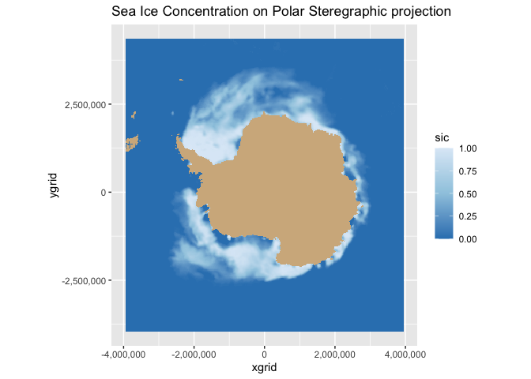

> history | Create July 2023 | Updated August 2023 

<a href="https://polarwatch.noaa.gov/" target="_blank">NOAA
PolarWatch</a> distributes gridded and tabular oceanographic data for
polar regions. Satellite data include geospatial information and most of
them are in geographical coordinates (latitude and longitude). Since the
spatial coverage of many PolarWatch satellite data products, are within
polar regions, the geospatial information is often represented in polar
projected coordinates.
(<a href="https://nsidc.org/data/user-resources/help-center/guide-nsidcs-polar-stereographic-projection" target="_blank">Polar
Stereographic Projections</a>).

When working with multiple satellite data sets from different crs
coordinates, it makes it challenging to do data analysis and the
coordinate transformation may be needed.

In this exercise, we will learn to transform coordinates of one
projection to another.

**The exercise demonstrates the following techniques:** - Downloading
and saving a netcdf file from PolarWatch ERDDAP data server - Accessing
satellite data and metadata in polar stereographic projection - Convert
the netcdf data into data.frame - Transforming coordinates using EPSG
codes - Mapping data using the transformed coordinates

**Datasets **

*Sea Ice Concentration*, NOAA/NSIDC Climate Data Record V4, Southern
Hemisphere, 25km, Science Quality, 1978-2022, Monthly

**R Packages**

-   ncdf4 (reading data and metadata in netCDF format)
-   ggplot2, RColorBrewer, scales (mapping)
-   sf (projection)

### Install required packages

This code block will check if required packages are installed, and will
install missing packages.

    # Function to check if pkgs are installed, install missing pkgs, and load
    pkgTest <- function(x)
    {
      if (!require(x,character.only = TRUE))
      {
        install.packages(x,dep=TRUE,repos='http://cran.us.r-project.org')
        if(!require(x,character.only = TRUE)) stop(x, " :Package not found")
      }
    }

    list.of.packages <- c("ncdf4" , "sf", "ggplot2","scales", "RColorBrewer")

    # create list of installed packages
    pkges = installed.packages()[,"Package"]
    for (pk in list.of.packages) {
      pkgTest(pk)
    }

## Antarctic Sea Ice Concentration Data

The sea ice concentration data are used to calculate the spatical
coverage of sea ice. The data product in this exercise is sea ice
concentration data of the southern hemisphere, and is produced by the
NOAA/NSIDC from passive microwave sensors using the Climate Data Record
(CDR). The data are projected in the southern polarstereographic
projection (**EPSG:3031**).

This sea ice concentration data values in the dataset are represented as
proportions ranging from 0 to 1. The resolution is 25km, meaning each
grid in this data set represents a value that covers a 25km by 25km
area. Please note that other values beyond 1 represents fill values.
More detailed information can be found in the NSIDC Data Product User
Guide (linke below)

**Userful links**

-   <a href="https://polarwatch.noaa.gov/catalog/ice-sq-nh-nsidc-cdr-v4/preview/?dataset=daily&var=cdr_seaice_conc&time_min=2022-05-31T00:00:00Z&time_max=2022-05-31T00:00:00Z&proj=epsg3413&colorBar=KT_ice|||0|1|" target="_blank">NOAA
    PolarWatch Data Product Page (download, preview)</a>
-   <a href="https://nsidc.org/data/g02202/versions/4" target="_blank">NSIDC
    Data Product Description</a>
-   <a href="https://nsidc.org/sites/default/files/g02202-v004-userguide_1_1.pdf" target="_blank">NSIDC
    Data Product User Guide (pdf)</a>

### Get data from ERDDAP

    # download the sea ice data NetCDF file
    url <- "https://polarwatch.noaa.gov/erddap/griddap/nsidcG02202v4shmday.nc?cdr_seaice_conc_monthly[(2022-12-01T00:00:00Z):1:(2022-12-01T00:00:00Z)][(4350000.0):1:(-3950000.0)][(-3950000.0):1:(3950000.0)]"

    sic <- download.file(url, destfile="sic.nc", mode='wb')

    # file open
    ds <- nc_open('sic.nc')

    # print metadata
    #print(ds)

    # get data into r variables 
    xgrid <- ncvar_get(ds, "xgrid")
    ygrid <- ncvar_get(ds, "ygrid")
    sic <- ncvar_get(ds, "cdr_seaice_conc_monthly")  #lat and lon
    dim(sic)

    ## [1] 316 332

    # close 
    nc_close(ds)

### Map polar stereographic projected data

    # create dataframe
    sicd <- expand.grid(xgrid=xgrid, ygrid=ygrid)
    sicd$sic <- array(sic, dim(xgrid)*dim(ygrid))

    # exclude fillvalue
    sicd$sic[sicd$sic > 2] <- NA 

    # map sea ice concentration
    ggplot(data = sicd, aes(x = xgrid, y = ygrid, fill=sic) ) + 
           geom_tile() + 
           coord_fixed(ratio = 1) + 
           scale_y_continuous(labels=comma) + 
           scale_x_continuous(labels=comma) +
           scale_fill_gradientn(colours=rev(brewer.pal(n = 3, name = "Blues")),na.value="tan")+       ggtitle("Sea Ice Concentration on Polar Steregraphic projection")

## Transforming from CRS to CRS

When transforming from one CRS to another, it is important to inspect
CRS definitions and the transformation function for proper
transformation. We will transform from CRS EPSG: 3031 (NSIDC Polar
Stereographic South) to EPSG: 4326 (geographic coordinate system)

    xy_sf <- st_as_sf(sicd, coords=c("xgrid", "ygrid"), crs=3031)

    # st_transform output order: lat , lon
    latlon_sf <- st_transform(xy_sf, crs=4326)

    latlon_df <- as.data.frame(st_coordinates(latlon_sf))
    names(latlon_df) <- c("Lat", "Lon")
    seaiceconc <- sicd$sic
    # create dataframe and add names
    sicdf_latlon <- data.frame(cbind(latlon_df,seaiceconc))
    head(na.omit(sicdf_latlon), 5)

    ##         Lat       Lon seaiceconc
    ## 1 -42.23257 -39.49708          0
    ## 2 -42.05101 -39.62425          0
    ## 3 -41.86840 -39.75110          0
    ## 4 -41.68474 -39.87763          0
    ## 5 -41.50003 -40.00383          0

### Plot data with new coordinates on a gloal map

    sic_sf <- st_as_sf(sicdf_latlon, coords = c('Lat', 'Lon'))
    st_crs(sic_sf) = "4326"

    # plot sea ice concentration on an unprojected map
    ggplot(sic_sf) + geom_sf(aes(color = seaiceconc)) + labs(title = "Sea Ice Concentration of Antarctica")

