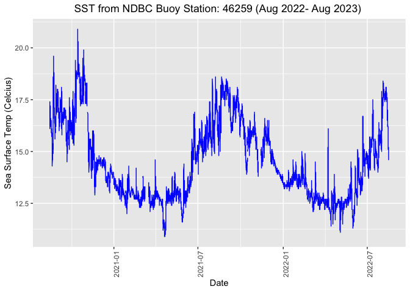
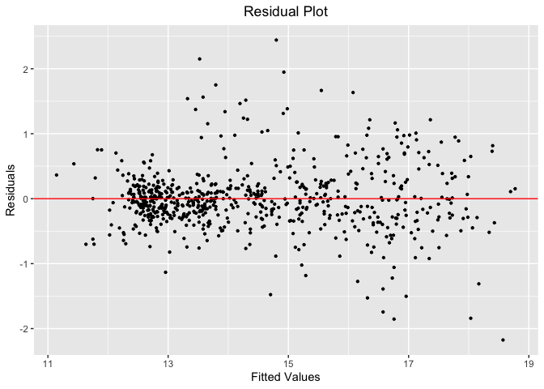

> Updated August 2023  

There are buoys in many locations around the world that provide data
streams of oceanic and atmospheric parameters. The data are often
available through data centers like the those National Data Buoy Center
(NDBC <https://www.ndbc.noaa.gov>), ARGO floats program
(<http://www.argo.ucsd.edu>) or ERDDAP data server (<https://www.our>
server). In situ buoy data are widely used to monitor environmental
conditions. In the absence of in situ buoy data, whether the buoy
operation is discontinued, interrupted, or limited, satellite data with
within temporal and spatial coverage can be used to create a dataset in
a buoy data format.

To demonstrate the satellite data being used in place of buoy data, we
will use sea surface temperature data which both satellite and buoy
collect.

## Objective

This tutorial will demonstration how to transform satellite data into a
buoy data format

## The tutorial demonstrates the following techniques

-   Download the satellite data and bouy data of the time period and
    spatial coverage
-   Visualize the datasets
-   Transform the satellite data into a buoy data format
-   Validate the transformed satellite data with the actual buoy data
-   Plot the transformed satellite data and the buoy data
-   Perform a linear regression of satellite vs. buoy data
-   Plot satellite vs. buoy data and overlay the regression line

## Datasets used

-   <a href="https://coastwatch.pfeg.noaa.gov/erddap/griddap/nesdisBLENDEDsstDNDaily.graph">The
    sea surface temperature (SST) satellite data</a> from NOAA Geo-polar
    blended analysis are used for transforming to buoy data format

-   Sea-Surface Temperature, NOAA Geo-polar Blended Analysis Day+Night,
    GHRSST,Near Real-Time, Global 5km, 2019-Present, Daily\*

-   <a href="https://coastwatch.pfeg.noaa.gov/erddap/tabledap/cwwcNDBCMet.graph?time%2Cwtmp%2Cwd&station=%2246259%22&time%3E=2020-09-15T00%3A00%3A00Z&time%3C=2022-09-15T00%3A00%3A00Z&.draw=markers&.marker=5%7C5&.color=0x000000&.colorBar=%7C%7C%7C%7C%7C&.bgColor=0xffccccff">
    NDBC Standard Meteorological Buoy Data </a> will be used to compare
    with the satellite data.

-   Buoy Station No. **46259**

-   Location: Off the California coast at 34.737N latitude and 121.664E
    longitude

## References

-   <a href="https://coastwatch.pfeg.noaa.gov/data.html">NOAA CoastWatch
    Westcoast Node Data Catalog</a>
-   <a href="https://www.ndbc.noaa.gov/download_data.php?filename=46259h2017.txt.gz&dir=data/historical/stdme ">NOAA
    National Data Buoy Center</a>

## Install required packages and load libraries

    # Function to check if pkgs are installed, and install any missing pkgs
    pkgTest <- function(x)
    {
      if (!require(x,character.only = TRUE))
      {
        install.packages(x,dep=TRUE,repos='http://cran.us.r-project.org')
        if(!require(x,character.only = TRUE)) stop(x, " :Package not found")
      }
    }

    # Create list of required packages
    list.of.packages <- c("utils", "ggplot2", "dplyr", "lubridate")

    # Create list of installed packages
    pkges = installed.packages()[,"Package"]

    # Install and load all required pkgs
    for (pk in list.of.packages) {
      pkgTest(pk)
    }

## Download NDBC buoy data (August 16 2020 - August 16 2022)

The virtual buoy data with Station ID \#46259 will be downloaded from
ERDDAP as the ground truth.

    buoy_url <- "https://coastwatch.pfeg.noaa.gov/erddap/tabledap/cwwcNDBCMet.csv?time%2Clongitude%2Clatitude%2Cwtmp&station%3E=%2246259%22&station%3C=%2246259%22&time%3E=2020-08-16T00%3A00%3A00Z&time%3C=2022-08-16T17%3A52%3A00Z"

    # Set file name
    fname = 'buoy.csv'

    # Download file
    download.file(buoy_url, fname)

    # Read into data frame, skip the first row
    buoy_df <- read.csv(fname, skip=2, header=TRUE)

    # Name the columns
    names(buoy_df) <- c("utc", "lon", "lat", "sst" )

    # Add formatted data column
    buoy_df$date <- as.Date(buoy_df$utc, tz = "UTC")

    # Show the first 3 rows
    head(buoy_df, 3)

    ##                    utc      lon    lat  sst       date
    ## 1 2020-08-16T00:56:00Z -121.664 34.732 16.8 2020-08-16
    ## 2 2020-08-16T01:26:00Z -121.664 34.732 16.9 2020-08-16
    ## 3 2020-08-16T01:56:00Z -121.664 34.732 16.6 2020-08-16

## Visualize SST from the Buoy

    options(repr.plot.width = 10)

    ggplot(buoy_df, aes(x = date, y = sst)) +
      geom_line(color='blue') +
     # geom_point(size=.2, color='red')+
      theme(axis.text.x = element_text(angle = 90),plot.title=element_text(hjust=0.5))+
       labs(x="Date", y="Sea Surface Temp (Celcius)", title="SST from NDBC Buoy Station: 46259 (Aug 2022- Aug 2023) ")

## Download the Satellite Sea Surface Temperature (SST) Data

the Sea Surface Temperature (SST) is the NOAA GeoPolar Blended SST
dataset (in Celcius) from many satellite sensors to obtain good daily
coverage of the globe at 5km resolution, and then an interpolation
method is applied to fill in data gaps.

The data request can be sent to CoastWatch ERDDAP server via URL with a
query string to specify the temporal and spatial coverage of our
interest. In this case, we want to subset the satellite data to match
the buoy station location.

To learn more about ERDDAP data request via URL, please go to
<a href="">ERDDAP module</a>.

### Sending data request to CoastWatch ERDDAP Server

    # Set ERDDAP URL with subset query string
    url <- "https://coastwatch.pfeg.noaa.gov/erddap/griddap/nesdisBLENDEDsstDNDaily.csv?analysed_sst%5B(2020-08-16T12:00:00Z):1:(2022-08-16T12:00:00Z)%5D%5B(34.737):1:(34.737)%5D%5B(-121.664):1:(-121.664)%5D"

    # Set file name
    fname = 'sst.csv'

    # Download file
    download.file(url, fname)

    # Read into data frame, skip first 2 rows that contain 
    sst_df <- read.csv(fname, skip=2, header=TRUE)
    names(sst_df) <- c("utc", "lat", "lon", "sst")
    # Add formatted data column
    sst_df$date <- as.Date(sst_df$utc, tz = "UTC")
    # Show the first 3 rows
    head(sst_df, 3)

    ##                    utc    lat      lon      sst       date
    ## 1 2020-08-17T12:00:00Z 34.725 -121.675 18.28999 2020-08-17
    ## 2 2020-08-18T12:00:00Z 34.725 -121.675 18.70999 2020-08-18
    ## 3 2020-08-19T12:00:00Z 34.725 -121.675 18.14999 2020-08-19

## Clean up the data

Apply a conservative allowable data range. For the lower end of the
range, the freezing point of seawater (ca. -2). For the high end of the
range, value unlikely to be seen in the area of interest (e.g. 45
degrees C).

    # Remove outliers sst values outside of -2 and 45 deg C
    sst_df_clean = sst_df %>%
      filter(sst >=-2 & sst <= 45)

## Visualize SST data from the Satellite Data

    ggplot(sst_df, aes(x = date, y = sst)) +
      geom_line(color='blue') +
      geom_point(size=.5, color='red')+
      theme(axis.text.x = element_text(angle = 90),plot.title=element_text(hjust=0.5))+
       labs(x="Date", y="Sea Surface Temp (Celcius)", title="2022 Aug- 2023 Aug Sea Surface Temperature at 34.736 deg North and -121.664 deg East")

## Resample the buoy data to match satellite data

The sampling resolution for the buoy data is a sample every 30 minutes.
However, the temporal resolution for the satellite dataset is daily. We
will downsample the buoy data by computing daily mean to match the
temporal resolution of the satellite data.

    buoy_ds <- buoy_df %>%
      group_by(date = floor_date(date, unit="days")) %>%
      summarise(mean_sst = mean(sst))

    head(buoy_ds, 3)

    ## # A tibble: 3 × 2
    ##   date       mean_sst
    ##   <date>        <dbl>
    ## 1 2020-08-16     16.7
    ## 2 2020-08-17     16.9
    ## 3 2020-08-18     16.4

## Clean up the data

Apply a conservative allowable data range. For the lower end of the
range, the freezing point of seawater (ca. -2). For the high end of the
range, value unlikely to be seen in the area of interest (e.g. 45
degrees C).

    # Remove outliers sst values outside of -2 and 45 deg C
    buoy_ds_clean = buoy_ds %>%
      filter(mean_sst >=-2 & mean_sst <= 45)

## Visualize downsampled buoy data

    ggplot(buoy_ds_clean, aes(x = date, y = mean_sst)) +
      geom_line(color='blue') +
      geom_point(size=.5, color='red')+
      theme(axis.text.x = element_text(angle = 90),plot.title=element_text(hjust=0.5))+
       labs(x="Date", y="Sea Surface Temp (Celcius)", title="2022 Aug- 2023 Aug Downsampled Buoy SST")

## Merge Satellite and Buoy data

We will use dplyr::inner\_join() function to merge two data frame
(satellite and buoy data) based on the dates appear on both dataframes.

    merged_df <- inner_join(sst_df_clean[c("date", "sst")],  buoy_ds_clean, by = "date")

## Plot both satellite and buoy data

    p <- ggplot(merged_df, aes(x = date)) +  
        geom_line(aes(y = sst, color = "Satellite")) +   
        geom_line(aes(y = mean_sst, color = "NDBC Buoy")) +   
        scale_color_manual(name = "Data source", 
                           values = c("Satellite" = "blue", "NDBC Buoy" = "orange"))+
        labs( x = "Date", y = "Temperature (in Celcius)", title="SST from Satellite and NDBC Buoy" )+
        theme(axis.text.x = element_text(angle = 0),plot.title=element_text(hjust=0.5))
     
    p

 \## Perform a simple linear
regression

    model <- lm(mean_sst ~ sst, data = merged_df)   

## Plot fiited vs. residuals

    ggplot() +
      geom_point(aes(x = model$fitted.values, y = model$residuals), size=0.8) +
      geom_hline(yintercept = 0, color = "red") +
      labs(x = "Fitted Values", y = "Residuals", title = "Residual Plot") +
      theme(plot.title=element_text(hjust=0.5))

