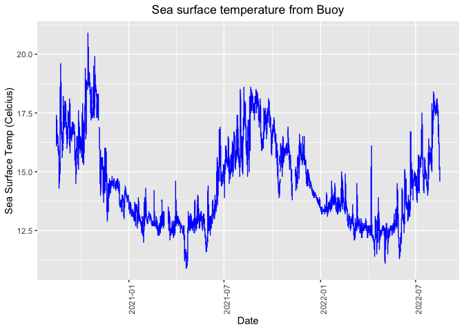
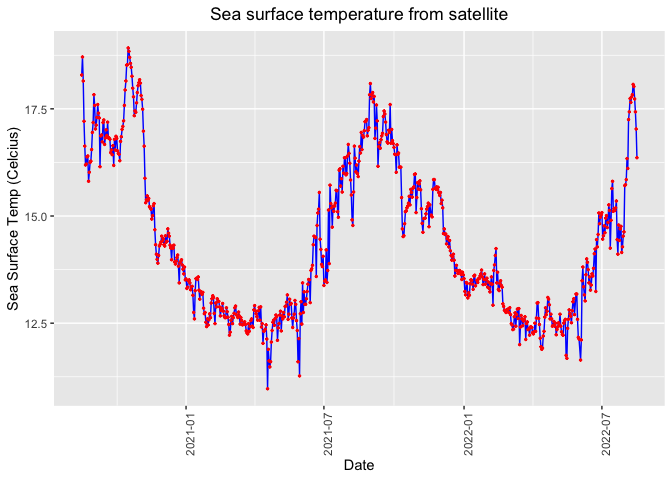

# Virtual Buoy example

> Updated August 2023  

There are buoys in many locations around the world that provide data
streams of oceanic and atmospheric parameters. The data are often
available through data centers like the those National Data Buoy Center
(NDBC <https://www.ndbc.noaa.gov>), ARGO floats program
(<http://www.argo.ucsd.edu>) or ERDDAP data server
(<https://coastwatch.pfeg.noaa.gov/erddap/>). In situ buoy data are
widely used to monitor environmental conditions. In the absence of in
situ buoy data, whether the buoy operation is discontinued, interrupted,
or limited, satellite data with within temporal and spatial coverage can
be used to create a dataset in a buoy data format.

## Objective

This tutorial will demonstration how to shape satellite data into a buoy
data format

## The tutorial demonstrates the following techniques

-   Downloading the satellite and buoy data from ERDDAP data server
-   Visualizing the datasets
-   Reshaping the satellite data into a buoy data format
-   Resampling buoy data (aggregation) to match satellite data temporal
    resolution
-   Validating the satellite data with the actual buoy data
-   Performing a linear regression of satellite vs. buoy data
-   Creating residual plot

## Datasets used

**Sea-Surface Temperature, NOAA Geo-polar Blended Analysis Day+Night,
GHRSST,Near Real-Time, Global 5km, 2019-Present, Daily**  
<a href="https://coastwatch.pfeg.noaa.gov/erddap/griddap/nesdisBLENDEDsstDNDaily.graph" target="_blank">The
sea surface temperature (SST) </a> satellite data from NOAA Geo-polar
blended analysis

**NDBC Standard Meteorological Buoy Data, 1970-present**
<a href="https://coastwatch.pfeg.noaa.gov/erddap/tabledap/cwwcNDBCMet.graph?time%2Cwtmp%2Cwd&station=%2246259%22&time%3E=2020-09-15T00%3A00%3A00Z&time%3C=2022-09-15T00%3A00%3A00Z&.draw=markers&.marker=5%7C5&.color=0x000000&.colorBar=%7C%7C%7C%7C%7C&.bgColor=0xffccccff">
NDBC Standard Meteorological Buoy Data </a> from the buoy station no.
**46259** are from off the California coast at 34.737N latitude and
121.664E longitude.

## References

-   <a href="https://coastwatch.pfeg.noaa.gov/data.html">NOAA CoastWatch
    Westcoast Node Data Catalog</a>
-   <a href="https://www.ndbc.noaa.gov/download_data.php?filename=46259h2017.txt.gz&dir=data/historical/stdme ">NOAA
    National Data Buoy Center</a>

## Install required packages and load libraries

    # Function to check if pkgs are installed, and install any missing pkgs
    pkgTest <- function(x)
    {
      if (!require(x,character.only = TRUE))
      {
        install.packages(x,dep=TRUE,repos='http://cran.us.r-project.org')
        if(!require(x,character.only = TRUE)) stop(x, " :Package not found")
      }
    }

    # Create list of required packages
    list.of.packages <- c("utils", "ggplot2", "dplyr", "lubridate")

    # Create list of installed packages
    pkges = installed.packages()[,"Package"]

    # Install and load all required pkgs
    for (pk in list.of.packages) {
      pkgTest(pk)
    }

## Download NDBC buoy data

We will download NDBC buoy data between August 16, 2020 and August 16,
2022 from the CoastWatch ERDDAP server.

The data can be downloaded by sending a data request to the ERDDAP
server via URL. The data request URL includes a dataset ID of our
interest and other query conditions if subset of the data product is of
interest.

To learn more about how to set up ERDDAP URL data request, please go to
<a href="" target="_blank">ERDDAP module page</a>.

    # Set ERDDAP data request URL
    buoy_url <- "https://coastwatch.pfeg.noaa.gov/erddap/tabledap/cwwcNDBCMet.csv?time%2Clongitude%2Clatitude%2Cwtmp&station%3E=%2246259%22&station%3C=%2246259%22&time%3E=2020-08-16T00%3A00%3A00Z&time%3C=2022-08-16T17%3A52%3A00Z"

    # Set file name
    fname = 'buoy.csv'

    # Download file
    download.file(buoy_url, fname)

    # Read into data frame, skip first 2 rows that contain variable names and units
    buoy_df <- read.csv(fname, skip=2, header=TRUE)

    # Name the columns
    names(buoy_df) <- c("utc", "lon", "lat", "sst" )

    # Add additional date column
    buoy_df$date <- as.Date(buoy_df$utc, tz = "UTC")

    # Show the first 3 rows
    head(buoy_df, 3)

    ##                    utc      lon    lat  sst       date
    ## 1 2020-08-16T00:56:00Z -121.664 34.732 16.8 2020-08-16
    ## 2 2020-08-16T01:26:00Z -121.664 34.732 16.9 2020-08-16
    ## 3 2020-08-16T01:56:00Z -121.664 34.732 16.6 2020-08-16

## Visualize SST from the Buoy

The plot shows the downloaded sea surface temperature by date.

    # Plot sea surface temperature values from buoy
    p <- ggplot(buoy_df, aes(x = date, y = sst)) +
        geom_line(color='blue') +
        theme(axis.text.x = element_text(angle = 90),plot.title=element_text(hjust=0.5))+
        labs(x="Date", y="Sea Surface Temp (Celcius)", title="Sea surface temperature from Buoy")
    p

## Download the Satellite Sea Surface Temperature (SST) Data

the Sea Surface Temperature (SST) is the NOAA GeoPolar Blended SST
dataset (in Celcius) from many satellite sensors to obtain good daily
coverage of the globe at 5km resolution, and then an interpolation
method is applied to fill in data gaps.

The data request can be sent to CoastWatch ERDDAP server via URL with a
query string to specify the temporal and spatial coverage of our
interest. In this case, we want to subset the satellite data to match
the buoy station location.

To learn more about ERDDAP data request via URL, please go to
<a href="">ERDDAP module</a>.

### Send satellite data request to CoastWatch ERDDAP Server

    # Set ERDDAP URL for the satellite data
    url <- "https://coastwatch.pfeg.noaa.gov/erddap/griddap/nesdisBLENDEDsstDNDaily.csv?analysed_sst%5B(2020-08-16T12:00:00Z):1:(2022-08-16T12:00:00Z)%5D%5B(34.737):1:(34.737)%5D%5B(-121.664):1:(-121.664)%5D"

    # Set file name
    fname = 'sst.csv'

    # Download file
    download.file(url, fname)

    # Read into data frame, skip first 2 rows that contain variable names and units
    sst_df <- read.csv(fname, skip=2, header=TRUE)
    names(sst_df) <- c("utc", "lat", "lon", "sst")

    # Add formatted data column
    sst_df$date <- as.Date(sst_df$utc, tz = "UTC")

    # Show the first 3 rows
    head(sst_df, 3)

    ##                    utc    lat      lon      sst       date
    ## 1 2020-08-17T12:00:00Z 34.725 -121.675 18.28999 2020-08-17
    ## 2 2020-08-18T12:00:00Z 34.725 -121.675 18.70999 2020-08-18
    ## 3 2020-08-19T12:00:00Z 34.725 -121.675 18.14999 2020-08-19

## Clean up the data

Apply a conservative allowable data range. For the lower end of the
range, the freezing point of seawater (ca. -2). For the high end of the
range, value unlikely to be seen in the area of interest (e.g. 45
degrees C).

    # Filter data that are within the valid range (-2 and 45)
    sst_df_clean = sst_df %>%
      filter(sst >=-2 & sst <= 45)

## Visualize SST data from the Satellite Data

    # Plot sea surface temperature values from satellite
    p <- ggplot(sst_df, aes(x = date, y = sst)) +
      geom_line(color='blue') +
      geom_point(size=.5, color='red')+
      theme(axis.text.x = element_text(angle = 90),plot.title=element_text(hjust=0.5))+
       labs(x="Date", y="Sea Surface Temp (Celcius)", title="Sea surface temperature from satellite")
    p

## Resample the buoy data to match satellite data

The sampling resolution for the buoy data is a sample every 30 minutes.
However, the temporal resolution for the satellite dataset is daily. We
will downsample the buoy data by computing daily mean to match the
temporal resolution of the satellite data.

    # Aggregating (taking a mean value) grouped by day
    buoy_ds <- buoy_df %>%
      group_by(date = floor_date(date, unit="days")) %>%
      summarise(mean_sst = mean(sst))

    # Show first 3 rows
    head(buoy_ds, 3)

    ## # A tibble: 3 × 2
    ##   date       mean_sst
    ##   <date>        <dbl>
    ## 1 2020-08-16     16.7
    ## 2 2020-08-17     16.9
    ## 3 2020-08-18     16.4

## Clean up the data

Apply a conservative allowable data range. For the lower end of the
range, the freezing point of seawater (ca. -2). For the high end of the
range, value unlikely to be seen in the area of interest (e.g. 45
degrees C).

    # Remove outliers sst values outside of -2 and 45 deg C
    buoy_ds_clean = buoy_ds %>%
      filter(mean_sst >=-2 & mean_sst <= 45)

## Visualize downsampled buoy data

    # Plot daily mean sst
    ggplot(buoy_ds_clean, aes(x = date, y = mean_sst)) +
      geom_line(color='blue') +
      geom_point(size=.5, color='red')+
      theme(axis.text.x = element_text(angle = 90),plot.title=element_text(hjust=0.5))+
       labs(x="Date", y="Sea Surface Temp (Celcius)", title="2022 Aug- 2023 Aug Downsampled Buoy SST")

## Merge Satellite and Buoy data

We will use dplyr::inner\_join() function to merge two data frame
(satellite and buoy data) based on the dates appear on both dataframes.

    # Combine two data frames with date column where dates exist in both data frame
    merged_df <- inner_join(sst_df_clean[c("date", "sst")],  buoy_ds_clean, by = "date")

## Plot both satellite and buoy data

    # Plot satellite sst and buoy daily mean sst 
    p <- ggplot(merged_df, aes(x = date)) +  
        geom_line(aes(y = sst, color = "Satellite")) +   
        geom_line(aes(y = mean_sst, color = "NDBC Buoy")) +   
        scale_color_manual(name = "Data source", 
                           values = c("Satellite" = "blue", "NDBC Buoy" = "orange"))+
        labs( x = "Date", y = "Temperature (in Celcius)", title="SST from Satellite and NDBC Buoy" )+
        theme(axis.text.x = element_text(angle = 0),plot.title=element_text(hjust=0.5))
    p

 \## Perform a simple linear
regression

    # Run linear regression 
    model <- lm(mean_sst ~ sst, data = merged_df)   

## Plot fitted vs. residuals

    # Plot fitted vs residuals 
    ggplot() +
      geom_point(aes(x = model$fitted.values, y = model$residuals), size=0.8) +
      geom_hline(yintercept = 0, color = "red") +
      labs(x = "Fitted Values", y = "Residuals", title = "Residual Plot") +
      theme(plot.title=element_text(hjust=0.5))

